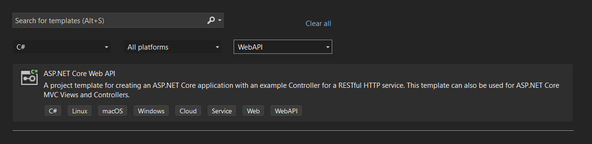
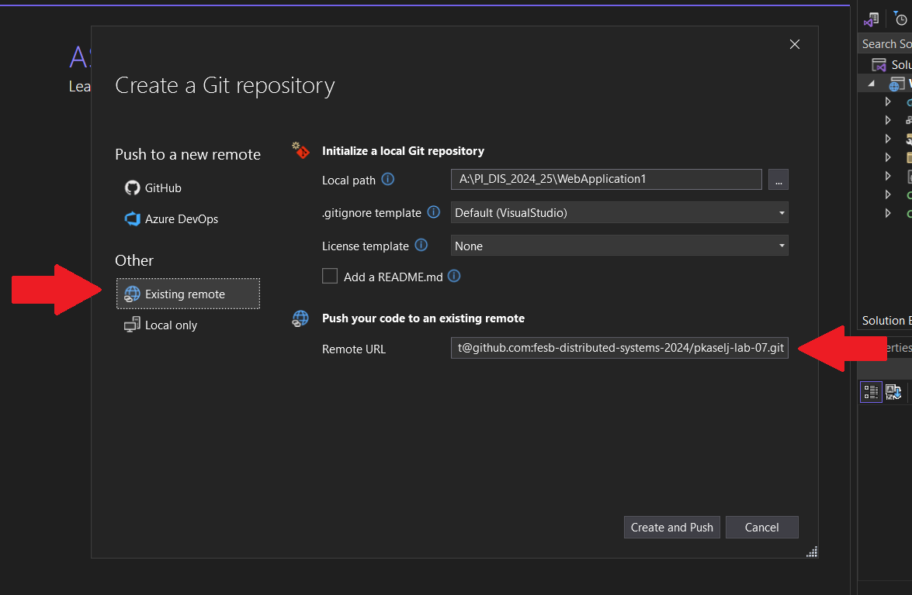

# Notes

## Table Of Contents

- [Notes](#notes)
	- [Table Of Contents](#table-of-contents)
	- [**Steps for Creating a Basic WebAPI**](#steps-for-creating-a-basic-webapi)
	- [**Hints**](#hints)
	- [Further Reading](#further-reading)
	- [Additional Hints](#additional-hints)
		- [**Creating a Project**](#creating-a-project)
		- [**Connecting VS2022 Project to Existing GitHub Repository**](#connecting-vs2022-project-to-existing-github-repository)

## **Steps for Creating a Basic WebAPI**

1. Create Project
   1. Create GitHub Repository
   2. Push project to GitHub
   3. Create and checkout new branch 'dev'
2. Delete Files:
   1. WeatherForecast.cs
   2. Controllers\WeateherForecastController.cs
3. Model
   1. Add fields
4. CRUD Controller
5. Singleton
6. Pull Request

## **Hints**

- Do not use HTTPS when creating a project
- Refer to the [SimpleWebApi-WeatherForecast GitHub Repo](https://github.com/fesb-distributed-systems-2024/SimpleWebApi-WeatherForecast) for a sample basic WebAPI
- Refer to the [pkaselj-lab-07 GitHub Repo](https://github.com/fesb-distributed-systems-2024/pkaselj-lab-07) for reference implementation.
- Refer to the [pkaselj-lab-07-plus GitHub Repo](https://github.com/fesb-distributed-systems-2024/pkasel-lab-07-plus) for last year's full project implementation. NOTE: Check out tag 1.0.0 for this phase
- Use [Postman](https://www.postman.com/) for testing the API

## Further Reading
- [Lambda Expressions in C#](https://www.c-sharpcorner.com/UploadFile/bd6c67/lambda-expressions-in-C-Sharp/)
- [IEnumerable](https://www.c-sharpcorner.com/UploadFile/0c1bb2/ienumerable-interface-in-C-Sharp/)
- [LINQ - Where/Any/All](https://stackoverflow.com/questions/25510430/how-to-select-items-from-ienumerable)
- [Controller Route](https://learn.microsoft.com/en-us/aspnet/web-api/overview/web-api-routing-and-actions/routing-in-aspnet-web-api)

## Additional Hints

### **Creating a Project**

### **Connecting VS2022 Project to Existing GitHub Repository**

